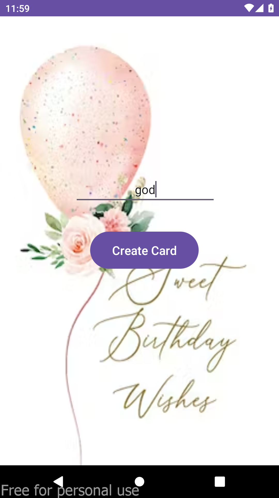
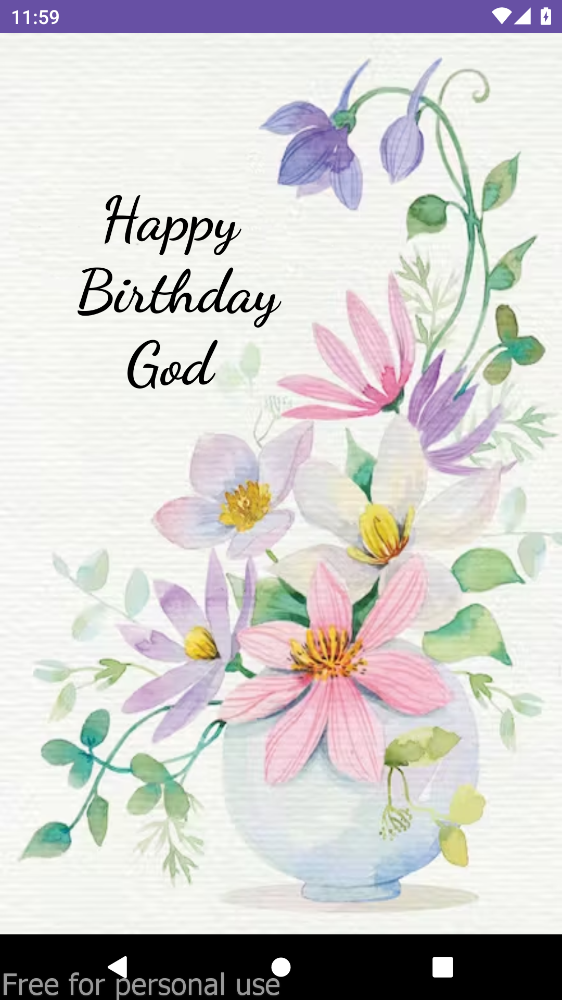

# Birthday Greeting App

This is my first Android app project, developed to send personalized birthday greetings.

## Overview

The Birthday Greeting App is a basic Android application developed to send birthday wishes to friends and family. Users can input the recipient's name and it shows birthday greeting card.

## Screenshots

  
  

## Getting Started

To run this project locally, follow these steps:

1. Clone this repository.
2. Open the project in Android Studio.
3. Run the app on an emulator or physical device.

## Technologies Used

- Kotlin
- Android Studio

## Credits

This app was developed by Me.

